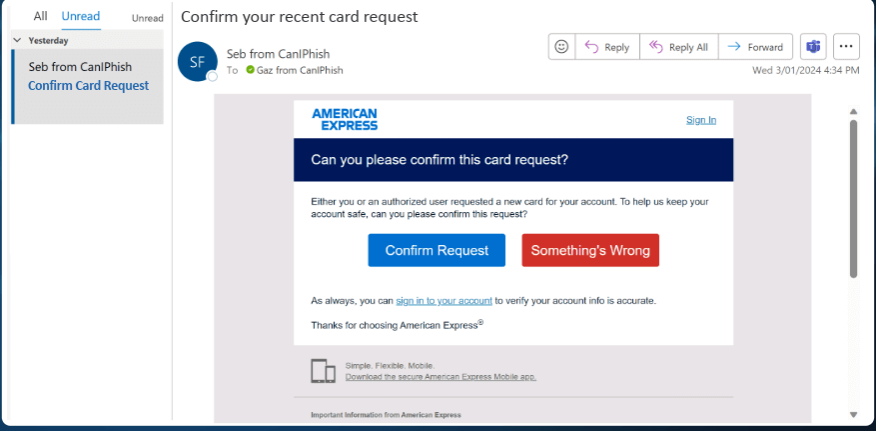

# Phishing Email Analysis – American Express Example

## Objective
Identify phishing characteristics in a suspicious American Express email sample and understand phishing tactics.

---

## Email Sample Overview

**Source:** Screenshot of an American Express phishing email (see `images/amex_phishing_email.png`)  
**Target:** American Express cardholders  
**Observed Behavior:** The email asks the recipient to “confirm a recent card request” with urgent call-to-action buttons (“Confirm Request” / “Something’s Wrong”).

---

## Phishing Indicators

| Indicator | Observations |
|-----------|--------------|
| **Sender’s Email Address** | Displayed as “Seb from CanIPhish.” Real American Express emails come from `@americanexpress.com`. This mismatch is a red flag. |
| **Email Headers** | Likely to show `Return-Path` from a non-Amex domain, suspicious sending IPs, and failing SPF/DKIM/DMARC checks. Example: `spf=fail`, `dmarc=fail`. |
| **Suspicious Links** | Buttons like “Confirm Request” may lead to domains such as `american-secure-login.com` or an IP address, not the legitimate `americanexpress.com`. Hovering would reveal the real link. |
| **Urgent Language** | “Can you please confirm this card request?” and implying possible account misuse pushes the victim to act quickly. |
| **Attachments** | This example contains no attachments, but phishing attempts may use PDFs or ZIPs with embedded links. |
| **Spelling & Grammar Errors** | Professional brands rarely send awkward wording. Phrases like “Can you please confirm this card request?” read slightly off compared to corporate standards. |
| **Mismatched URLs** | Visible link text suggests “Sign In” to American Express, but the hover URL likely points to a phishing domain. |
| **Social Engineering Tactics** | Exploits fear of fraud (someone requesting a card) and urgency to secure the account, while using official branding (logo, colors) to build trust. |

---

## Analysis Summary

- The email is **not legitimate**; it is a phishing attempt.  
- Key red flags: spoofed sender, non-Amex domain, urgent call-to-action, mismatched links, and subtle wording issues.  
- **Purpose:** Trick recipients into entering login credentials or personal data on a fake site.

---

## Recommended Actions

1. Do **not click the links** or enter any credentials.  
2. Report the email to American Express: `spoof@americanexpress.com`.  
3. Mark the message as spam/phishing in your mail client.  
4. Verify account status only through the official American Express website or mobile app.  
5. Share phishing awareness training with employees/users.  

---

## Key Concepts for Interview

1. **Phishing:** Fraudulent attempt to obtain sensitive data by imitating a trusted entity.  
2. **Identifying Phishing:** Look for suspicious senders, mismatched domains, fake links, poor grammar, and urgency.  
3. **Email Spoofing:** Manipulating headers so the message appears to come from a trusted domain.  
4. **Dangers:** Credential theft, identity fraud, financial loss, malware infection.  
5. **Verify Sender:** Inspect headers, check SPF/DKIM/DMARC, compare sending IPs, and verify via official contact channels.  
6. **Tools for Header Analysis:** MXToolbox, Google Admin Toolbox, mailheader.org, SPF/DKIM lookup tools.  
7. **Actions on Suspected Email:** Don’t click links, don’t download attachments, report and delete, notify SOC/IT.  
8. **Social Engineering:** Leveraging urgency, fear, and brand trust to manipulate users into unsafe actions.  

---

## Deliverables

- Screenshot of the phishing email (already provided).  
- Table of phishing indicators (above).  
- Example phishing headers (see mock sample below).  
- This README.md style documentation.  

---

## Screenshots

### American Express Phishing Email
  

### Email Header Analysis
  
